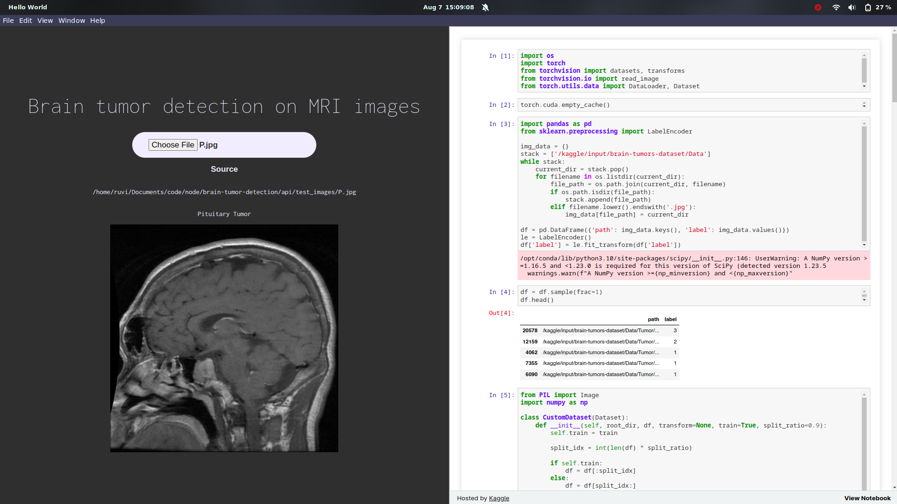

# Brain Tumor Detection using PyTorch CNN with Electron Frontend and Flask Backend



## Introduction

This project is an open-source implementation of a Brain Tumor Detection system using a Convolutional Neural Network (CNN) trained on 12,000 MRI scans of the brain. The CNN model is built using the PyTorch framework, and it is integrated with a cross-platform Electron frontend and a Flask backend to create a user-friendly application.

The purpose of this project is to provide a reliable tool for detecting brain tumors in MRI scans, which can aid medical professionals in diagnosing brain-related conditions. The trained model an accuracy of 96% in detecting tumors and can be utilized for both research and practical medical purposes.

## Features

- Accurate Brain Tumor Detection: The CNN model is trained on a large dataset of MRI scans, enabling it to accurately detect brain tumors.
- Classifies between four classes i.e 0: "Normal", 1: "Glioma Tumor", 2: "Meningioma Tumor", 3: "Pituitary Tumor"
- Cross-Platform Electron Frontend: The Electron frontend provides a user-friendly graphical interface, making the application accessible on multiple platforms.
- Python Flask Backend: The Flask backend serves as an API to interact with the CNN model and handle incoming requests from the frontend.
- Easy-to-Use Interface: The application offers a simple and intuitive user interface for uploading MRI scans and obtaining tumor detection results.

## Installation

Follow these steps to set up the Brain Tumor Detection application:

1. Clone the GitHub repository:

   ```
   git clone https://github.com/ar5entum/brain-tumor-detection-on-MRI-images.git
   cd brain-tumor-detection
   ```

2. Download the PyTorch weights:

   ```
   curl -o api/weights.pth https://www.kaggleusercontent.com/kf/138592033/eyJhbGciOiJkaXIiLCJlbmMiOiJBMTI4Q0JDLUhTMjU2In0..3fzUvts0SwSwjzqJSAmLaA.yE1nyuNhOP6tRvNVRgAcEnEC-0kSgHLyZvBbSTAxGKj4l_mTxB2v53I70rDk6gkIhzOh8Xy54y13valq83C7fscg7d95_Q3N7RJY_iFCq3UkqlZljl-aMdGgJcucy9pPMsl_SLv9kPqjAnx1pR0i24z1sDnsib4JRlPE5DoZ7jyESdcy9Nw0rmUueTM8GrFEEZ757M6s1BPkEKEgh7m_Gi2Cx1KFQTG9X9w8wo3qSwYJmHY3qScm1ptR436YU9j8PXc5Otkam6r-psPCF4Z5mPTcXINNSUarG6B9-r19qm_2MSa_11F88f-eplXfl_14ethmNbmZKeQlRepD6h354T7pdgYXlXrq9p8hDbBe-t_kYUJz2vG9qzZwAcxyryxrwoQ8I0pDWmmHmQvP_U3XQquvsvGiqQzlJdG74NEe-avz_umplxS8LbMMDaiYKByH0r9EAedFehznkVSLH0bJgQTddy949Nsev2Iwhm4udJMkjXHMjlUXRluibgrssVET3rbY1IuJoXB5sKQZUHs8o69Ikh7QDG6PXiIVV9iJkQCmBRrS2NkTF5lAYM6eX-kNWoPtcIWiWecS13zwDhHOv8oHW8uFynTYZ6p9kn57OC3CJB0XobSkhAktHNkv1_E4nrnru2HwxdPjUGWI71Vw_kZZNJXxrzPrzZZ0W6XbnKaVBo6GYcsLrfbpPIZJVieW.xp2julIMl81QfpInvB7ifw/3.model.pth
   ```

3. Set up the Python environment and install dependencies:

   ```
   pip install -r requirements.txt
   ```

4. Install Node.js and npm to handle the Electron frontend:

   ```
   node -v # Using v18.17.0
   npm -v # Using 9.6.7
   ```

5. Set up the Electron frontend:

   ```
   npm install
   ```

## Usage

1. Launch the Application:

   ```
   npm start
   ```

2. The Electron application window will open. Use the intuitive interface to upload MRI scans and obtain brain tumor detection results.

## Dataset

The CNN model was trained on a dataset of 12,000 MRI scans of the brain, collected from various sources, as included in Kaggle. The dataset is not included with this repository due to its large size, but you can obtain a similar dataset from publicly available sources or medical research organizations.
https://www.kaggle.com/datasets/mohammadhossein77/brain-tumors-dataset

<!-- ## License

This project is licensed under the [MIT License](LICENSE). -->

## Acknowledgments

I would like to express our gratitude to the open-source community, PyTorch, Electron, Flask, and Kaggle for their valuable contributions, which made this project possible.

## Contact

If you have any questions or feedback, please feel free to contact at [astitvajaiswal01@gmail.com](mailto:astitvajaiswal01@gmail.com).

---
